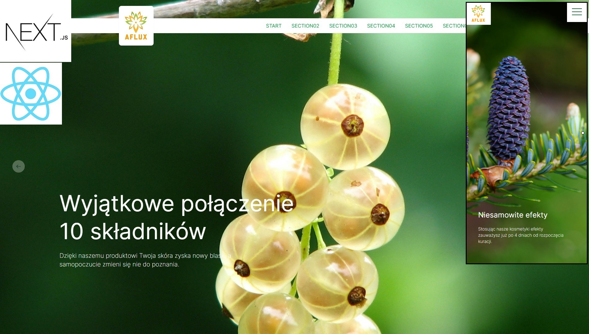
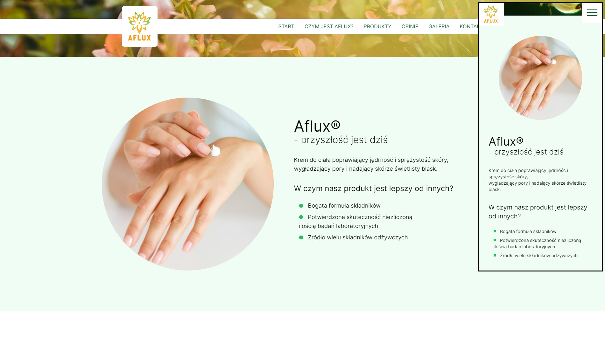
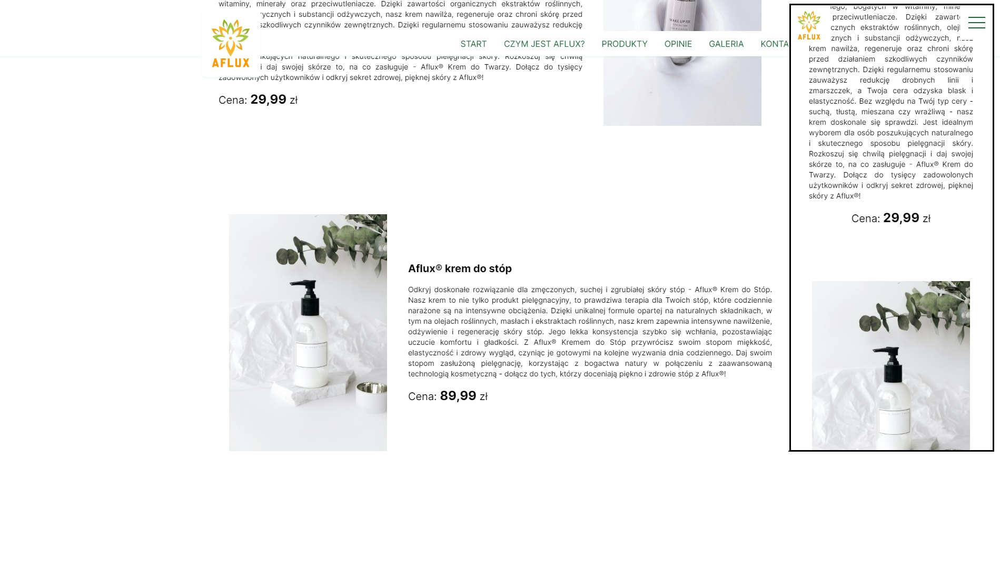
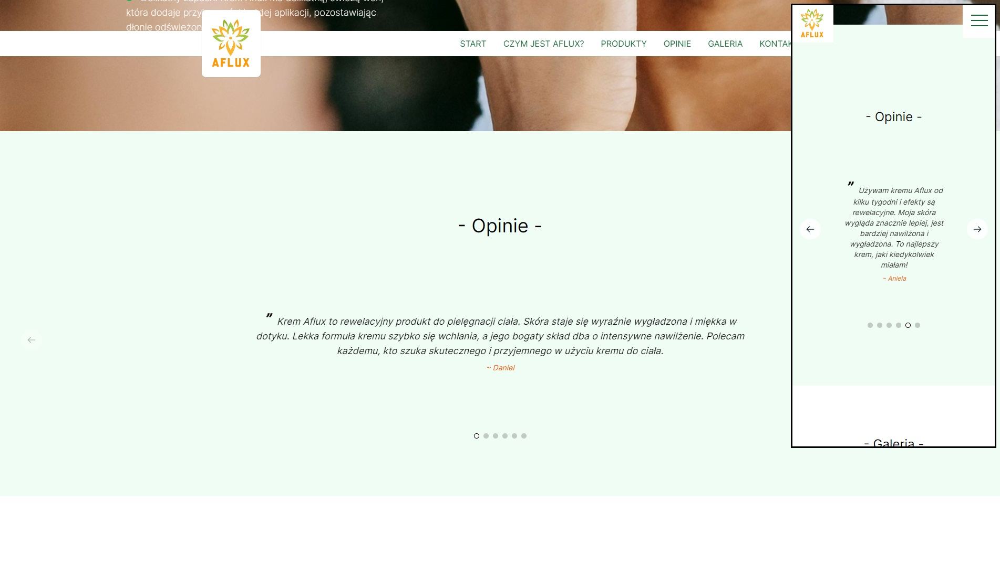

## General info

Aflux® is a Next.js website connected with beauty industry ➡️ written using modern technologies like Next.js 13, TypeScript, TailwindCSS extended with SCSS.

Aflux® website contains a section dedicated to describing what the product is, sections containing a detailed product description, reviews from our satisfied customers, photo galleries, and a contact section.

This is a [Next.js](https://nextjs.org/) project bootstrapped with [`create-next-app`](https://github.com/vercel/next.js/tree/canary/packages/create-next-app).  
This project uses [`next/font`](https://nextjs.org/docs/basic-features/font-optimization) to automatically optimize and load Inter, a custom Google Font.

## Technologies

Used technologies:

- TypeScript
- Next.js
- React.js
- AoS.js
- TailwindCSS
- SCSS

## Used images source:

- [Pexels](https://www.pexels.com/)

## Live link :star:

- https://goldipl.github.io/aflux-next/

## How to open project locally?

Firstly clone this project locally using command below in your IDE:

```bash
git clone https://github.com/goldipl/aflux-next.git
```

Secondly type:

```bash
npm i
```

After run the development server:

```bash
npm run dev
# or
yarn dev
# or
pnpm dev
# or
bun dev
```

Open [http://localhost:3000](http://localhost:3000) with your browser to see the result.

## Learn more about Next.js

To learn more about Next.js, take a look at the following resources:

- [Next.js Documentation](https://nextjs.org/docs) - learn about Next.js features and API.
- [Learn Next.js](https://nextjs.org/learn) - an interactive Next.js tutorial.

You can check out [the Next.js GitHub repository](https://github.com/vercel/next.js/) - your feedback and contributions are welcome!

## Possible/another option to Deploy this App on Vercel

The easiest way to deploy your Next.js app is to use the [Vercel Platform](https://vercel.com/new?utm_medium=default-template&filter=next.js&utm_source=create-next-app&utm_campaign=create-next-app-readme) from the creators of Next.js.

Check out our [Next.js deployment documentation](https://nextjs.org/docs/deployment) for more details.

## More info about projects code

All components have been built in such a way that new elements can be added dynamically.
For example, to extend the menu with an additional navigation element, go to the file under the path:

```
/src/components/constants/header-links.tsx
```

and add another line/object inside the `HEADER_LINKS` array:

```typescript
export const HEADER_LINKS = [
  { href: "#start", key: "start", label: "Start" },
  { href: "#aflux-info", key: "aflux-info", label: "Czym jest Aflux?" },
  { href: "#products", key: "products", label: "Produkty" },
  { href: "#opinions", key: "opinions", label: "Opinie" },
  { href: "#gallery", key: "gallery", label: "Galeria" },
  { href: "#contact", key: "contact", label: "Kontakt" },
];
```

Similarly, to add a new product in the `Products.tsx` component, navigate to:

```
/src/components/Products/Products.tsx
```

and add a new Product typing a new object in `ProductsItemsList` array below:

```typescript
const ProductsItemsList = [
  {
    source: product_img01.src,
    width: 300,
    height: 341,
    text: "Aflux® krem do rąk",
    alt_text: "produkt",
    text_description:
      "Aflux, renomowana marka kosmetyków, prezentuje swoją najnowszą propozycję - krem do rąk o niezrównanej jakości i skuteczności. Ten wyjątkowy produkt został stworzony z myślą o pielęgnacji skóry dłoni, dbając jednocześnie o nawilżenie, odżywienie i ochronę. Formuła kremu została opracowana z użyciem najwyższej jakości składników, które doskonale pielęgnują i regenerują skórę. Bogate w substancje odżywcze i witaminy, krem głęboko nawilża skórę, przywracając jej elastyczność i miękkość. Dzięki zawartości naturalnych ekstraktów roślinnych, zapewnia on intensywną regenerację nawet najbardziej wysuszonej skóry.",
    price: "49,99",
  },
  {
    source: product_img02.src,
    width: 300,
    height: 341,
    text: "Aflux® krem do twarzy",
    alt_text: "produkt",
    text_description:
      "Odkryj tajemnicę piękna Twojej skóry dzięki Aflux® Kremowi do Twarzy - innowacyjnemu rozwiązaniu, które łączy w sobie potęgę naturalnych składników i zaawansowanej technologii kosmetycznej. Nasz krem to nie tylko produkt pielęgnacyjny, to codzienna dawka luksusu i blasku dla Twojej cery. Jego unikalna formuła opiera się na starannie dobranych składnikach pochodzenia roślinnego, bogatych w witaminy, minerały oraz przeciwutleniacze. Dzięki zawartości organicznych ekstraktów roślinnych, olejków eterycznych i substancji odżywczych, nasz krem nawilża, regeneruje oraz chroni skórę przed działaniem szkodliwych czynników zewnętrznych. Dzięki regularnemu stosowaniu zauważysz redukcję drobnych linii i zmarszczek, a Twoja cera odzyska blask i elastyczność. Bez względu na Twój typ cery - suchą, tłustą, mieszana czy wrażliwą - nasz krem doskonale się sprawdzi. Jest idealnym wyborem dla osób poszukujących naturalnego i skutecznego sposobu pielęgnacji skóry. Rozkoszuj się chwilą pielęgnacji i daj swojej skórze to, na co zasługuje - Aflux® Krem do Twarzy. Dołącz do tysięcy zadowolonych użytkowników i odkryj sekret zdrowej, pięknej skóry z Aflux®!",
    price: "29,99",
  },
  {
    source: product_img03.src,
    width: 300,
    height: 341,
    text: "Aflux® krem do stóp",
    alt_text: "produkt",
    text_description:
      "Odkryj doskonałe rozwiązanie dla zmęczonych, suchej i zgrubiałej skóry stóp - Aflux® Krem do Stóp. Nasz krem to nie tylko produkt pielęgnacyjny, to prawdziwa terapia dla Twoich stóp, które codziennie narażone są na intensywne obciążenia. Dzięki unikalnej formule opartej na naturalnych składnikach, w tym na olejach roślinnych, masłach i ekstraktach roślinnych, nasz krem zapewnia intensywne nawilżenie, odżywienie i regenerację skóry stóp. Jego lekka konsystencja szybko się wchłania, pozostawiając uczucie komfortu i gładkości. Z Aflux® Kremem do Stóp przywrócisz swoim stopom miękkość, elastyczność i zdrowy wygląd, czyniąc je gotowymi na kolejne wyzwania dnia codziennego. Daj swoim stopom zasłużoną pielęgnację, korzystając z bogactwa natury w połączeniu z zaawansowaną technologią kosmetyczną - dołącz do tych, którzy doceniają piękno i zdrowie stóp z Aflux®!",
    price: "89,99",
  },
  {
    source: product_img04.src,
    width: 300,
    height: 341,
    text: "Aflux® krem pod oczy",
    alt_text: "produkt",
    text_description:
      "Rozpocznij dzień z pięknymi, promiennymi oczami dzięki Aflux® Kremowi Pod Oczy - wyjątkowemu rozwiązaniu pielęgnacyjnemu, które rewitalizuje, nawilża i odmładza delikatną skórę wokół oczu. Nasz krem to nie tylko produkt kosmetyczny, to właściwa dawka pielęgnacji, która przywraca świeżość i blask Twojemu spojrzeniu. Dzięki zaawansowanej formule opartej na składnikach pochodzenia roślinnego, w tym na ekstraktach roślinnych, witaminach i peptydach, Aflux® Krem Pod Oczy redukuje widoczność cieni i worków pod oczami, wygładza drobne linie i zmarszczki, oraz eliminuje oznaki zmęczenia. Lekka konsystencja kremu delikatnie się wchłania, nie obciążając skóry, zapewniając uczucie komfortu i świeżości. Pozwól swoim oczom odzyskać blask i witalność, dbając o nie codziennie z Aflux® Kremem Pod Oczy - odkryj tajemnicę młodszego, bardziej promiennego spojrzenia już dziś!",
    price: "104,99",
  },
];
```

## Screenshots

There are some desktop & mobile screenshots of my project. Take a look.







